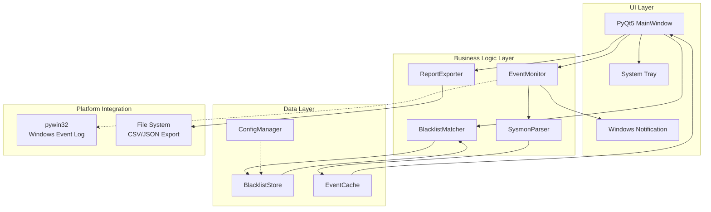
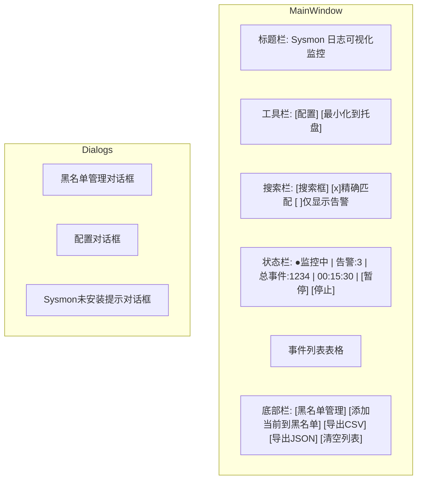
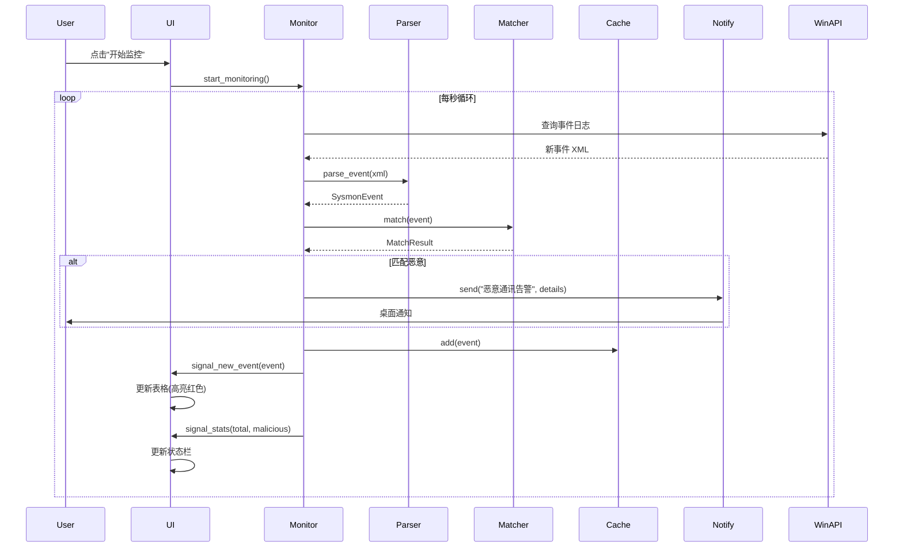
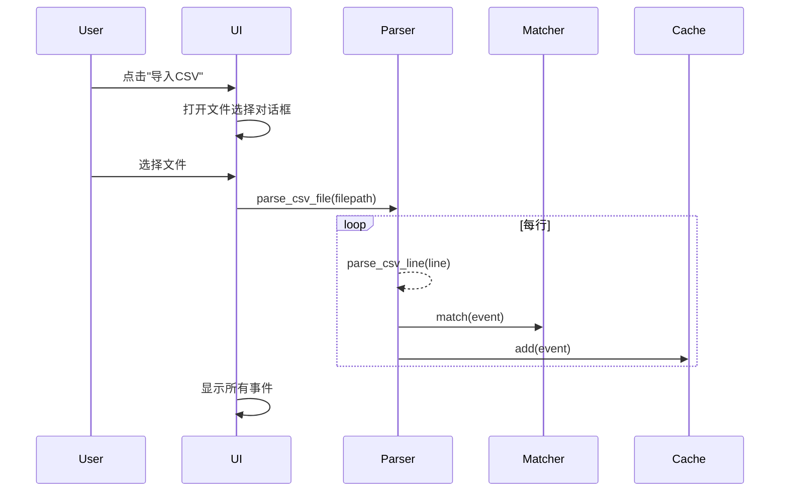

# Sysmon Log Visual Monitor - Technical Design Specification

Feature Name: sysmon-log-monitor
Updated: 2026-03-27

## Description

Sysmon Log Visual Monitor 是一款 Windows 平台的 Sysmon 日志可视化监控工具，通过实时读取 Windows 事件日志通道，帮助安全分析人员快速识别与恶意域名/IP 的通讯行为。

## Architecture



## Components and Interfaces

### 1. EventMonitor

负责实时监控 Windows 事件日志通道。

```python
class EventMonitor(QThread):
    signal_new_event = pyqtSignal(dict)      # 新事件信号
    signal_error = pyqtSignal(str)           # 错误信号
    signal_stats = pyqtSignal(int, int)     # 统计数据信号
    
    def __init__(self, channel: str = "Microsoft-Windows-Sysmon/Operational"):
        self.channel = channel
        self._running = False
        self._paused = False
        
    def start_monitoring(self):
        """开始监控"""
        
    def stop_monitoring(self):
        """停止监控"""
        
    def pause_monitoring(self):
        """暂停监控"""
        
    def resume_monitoring(self):
        """恢复监控"""
```

### 2. SysmonParser

解析 Sysmon EventID=3 事件数据。

```python
class SysmonParser:
    @staticmethod
    def parse_event(event_xml: str) -> Optional[dict]:
        """解析单个事件 XML"""
        
    @staticmethod
    def parse_csv_line(line: str) -> Optional[dict]:
        """解析 CSV 行"""
        
    @staticmethod
    def get_field(event: dict, field_name: str) -> str:
        """获取事件字段"""
```

### 3. BlacklistMatcher

黑名单匹配引擎。

```python
class BlacklistMatcher:
    def __init__(self):
        self._ip_set = set()      # IP 黑名单集合
        self._domain_set = set()   # 域名黑名单集合
        self._loaded = False
        
    def load_from_file(self, filepath: str) -> bool:
        """从文件加载黑名单"""
        
    def add_entry(self, entry: str) -> bool:
        """添加单个条目"""
        
    def remove_entry(self, entry: str) -> bool:
        """删除单个条目"""
        
    def match(self, event: dict) -> MatchResult:
        """匹配事件"""
        # 返回: MatchResult(ip_matched=True/False, domain_matched=True/False, is_malicious=True/False)
```

### 4. EventCache

事件数据缓存，支持高效检索。

```python
class EventCache:
    def __init__(self, max_size: int = 10000):
        self._events = []  # 事件列表
        self._index = {}   # 索引
        
    def add(self, event: dict):
        """添加事件"""
        
    def get_all(self) -> list:
        """获取所有事件"""
        
    def filter(self, predicate: Callable) -> list:
        """条件过滤"""
        
    def clear(self):
        """清空缓存"""
```

### 5. ReportExporter

报告导出功能。

```python
class ReportExporter:
    @staticmethod
    def export_csv(events: list, filepath: str) -> bool:
        """导出为 CSV"""
        
    @staticmethod
    def export_json(events: list, filepath: str) -> bool:
        """导出为 JSON"""
```

### 6. ConfigManager

配置管理。

```python
class ConfigManager:
    CONFIG_FILE = "config.ini"
    
    def get_blacklist_path(self) -> str:
        """获取黑名单路径"""
        
    def set_blacklist_path(self, path: str):
        """设置黑名单路径"""
        
    def get_window_geometry(self) -> tuple:
        """获取窗口几何信息"""
        
    def save(self):
        """保存配置"""
```

### 7. NotifyManager

Windows 通知管理，兼容 Win7。

```python
class NotifyManager:
    def __init__(self):
        self._use_modern = self._check_win10()
        
    def send(self, title: str, message: str):
        """发送通知"""
        if self._use_modern:
            # Win10+ Toast Notification
        else:
            # Win7 Balloon Tip via ctypes
```

## Data Models

### SysmonEvent

```python
@dataclass
class SysmonEvent:
    timestamp: datetime       # 时间
    source_ip: str           # 源IP
    source_port: int         # 源端口
    dest_ip: str             # 目的IP
    dest_port: int           # 目的端口
    dest_hostname: str       # 目的域名
    protocol: str            # 协议 TCP/UDP
    process_name: str        # 进程名
    process_path: str        # 进程路径
    process_id: int          # PID
    user: str                # 用户
    is_malicious: bool       # 是否恶意
    matched_entry: str       # 匹配的黑名单条目
    
    def to_dict(self) -> dict:
        """转换为字典"""
        
    def to_csv_row(self) -> list:
        """转换为 CSV 行"""
```

### MatchResult

```python
@dataclass
class MatchResult:
    ip_matched: bool = False
    domain_matched: bool = False
    is_malicious: bool = False
    matched_entry: str = ""
```

### BlacklistEntry

```python
@dataclass
class BlacklistEntry:
    value: str               # IP 或域名
    entry_type: str          # "ip" 或 "domain"
    source: str              # 来源: "file" 或 "manual"
    created_at: datetime     # 添加时间
    
    @staticmethod
    def parse(line: str) -> Optional["BlacklistEntry"]:
        """解析黑名单行"""
```

## UI Layout



## Table Column Definition

| 列索引 | 字段名 | 宽度 | 对齐 | 说明 |
|--------|--------|------|------|------|
| 0 | 时间 | 80 | 左 | HH:MM:SS 格式 |
| 1 | 源IP | 110 | 左 | IPv4/IPv6 |
| 2 | 目的IP | 110 | 左 | IPv4/IPv6 |
| 3 | 目的域名 | 150 | 左 | DNS 域名 |
| 4 | 端口 | 50 | 中 | 目标端口 |
| 5 | 协议 | 50 | 中 | TCP/UDP |
| 6 | 进程名 | 100 | 左 | 可执行文件名 |
| 7 | PID | 50 | 中 | 进程ID |
| 8 | 判定 | 60 | 中 | ✓正常/⚠恶意 |

## Event Flow

### 实时监控流程



### CSV 导入流程



## Error Handling

### 错误场景与处理

| 场景 | 处理方式 | 用户提示 |
|------|---------|---------|
| Sysmon 未安装 | 弹出安装引导对话框 | "Sysmon 未安装，点击此处下载" |
| 无管理员权限 | 提示以管理员运行 | "请右键选择 '以管理员身份运行'" |
| 事件日志读取失败 | 重试3次后提示错误 | "无法读取事件日志，请检查权限" |
| CSV 文件格式错误 | 跳过该文件继续 | "文件 XXX 格式错误，已跳过" |
| 黑名单文件不存在 | 创建新文件 | (静默) |
| 导出文件写入失败 | 提示错误 | "导出失败，请检查磁盘空间" |

## Test Strategy

### 单元测试

| 模块 | 测试用例 |
|------|---------|
| SysmonParser | parse_event XML 解析<br>parse_csv_line CSV 解析<br>字段提取正确性 |
| BlacklistMatcher | IP 匹配<br>域名匹配(部分匹配)<br>空黑名单处理 |
| EventCache | 添加事件<br>过滤功能<br>清空功能 |
| BlacklistEntry | 有效 IP 解析<br>有效域名解析<br>无效格式拒绝 |

### 集成测试

| 场景 | 预期结果 |
|------|---------|
| 正常启动(有 Sysmon) | 窗口显示，状态为"未监控" |
| 正常启动(无 Sysmon) | 显示安装引导对话框 |
| 点击开始监控 | 状态变为"监控中"，实时更新事件 |
| 导入恶意流量 CSV | 告警计数增加，相关行高亮红色 |
| 触发告警 | 桌面通知弹出 |
| 最小化到托盘 | 窗口隐藏，托盘图标显示 |

## Dependencies

| 包名 | 版本 | 用途 |
|------|------|------|
| Python | 3.8.x | 运行时 (Win7 最后支持版本) |
| PyQt5 | 5.15.x | GUI 框架 |
| pywin32 | 228+ | Windows API 调用 |
| PyInstaller | 4.x | 打包为 exe |

## File Structure

```
sysmon-log-monitor/
├── main.py                 # 程序入口
├── requirements.txt        # 依赖清单
├── spec/
│   └── ...                 # 构建规范
├── src/
│   ├── __init__.py
│   ├── main_window.py      # 主窗口
│   ├── dialogs/
│   │   ├── __init__.py
│   │   ├── blacklist_dialog.py
│   │   ├── config_dialog.py
│   │   └── sysmon_not_found_dialog.py
│   ├── monitors/
│   │   ├── __init__.py
│   │   └── event_monitor.py
│   ├── parsers/
│   │   ├── __init__.py
│   │   └── sysmon_parser.py
│   ├── matchers/
│   │   ├── __init__.py
│   │   └── blacklist_matcher.py
│   ├── models/
│   │   ├── __init__.py
│   │   ├── event.py
│   │   └── blacklist.py
│   ├── utils/
│   │   ├── __init__.py
│   │   ├── config_manager.py
│   │   ├── notify_manager.py
│   │   └── report_exporter.py
│   └── cache/
│       ├── __init__.py
│       └── event_cache.py
├── assets/
│   └── icon.ico            # 应用图标
├── build/
│   └── build.spec          # PyInstaller 配置
└── README.md
```

## PyInstaller Build Configuration

```python
# build.spec
a = Analysis(['main.py'],
    hiddenimports=['PyQt5', 'pywin32'],
    ...)
    
pyz = PYZ(a.pure)
    
exe = EXE(pyz,
    a.scripts,
    a.binaries,
    a.datas,
    name='SysmonLogMonitor',
    debug=False,
    onefile=True,           # 单文件打包
    icon='assets/icon.ico',
    manifest='manifest.xml', # Windows 清单 (Win7 兼容性)
    ...)
```

## Windows Manifest (Win7 兼容性)

```xml
<?xml version="1.0" encoding="UTF-8"?>
<assembly xmlns="urn:schemas-microsoft-com:asm.v1"
          manifestVersion="1.0">
  <compatibility xmlns="urn:schemas-microsoft-com:compatibility.v1">
    <application>
      <!-- Windows 7 SP1 -->
      <supportedOS Id="{35138b9a-5d96-4fbd-8e2d-a2440225f93a}"/>
      <!-- Windows 10 -->
      <supportedOS Id="{8e0f7a12-bfb3-4fe8-b9a5-48fd50a15a9a}"/>
    </application>
  </compatibility>
  <trustInfo xmlns="urn:schemas-microsoft-com:asm.v3">
    <security>
      <requestedPrivileges>
        <requestedExecutionLevel level="requireAdministrator"
                                 uiAccess="false"/>
      </requestedPrivileges>
    </security>
  </trustInfo>
</assembly>
```

## References

- [Sysmon - Windows Sysinternals](https://docs.microsoft.com/en-us/sysinternals/downloads/sysmon)
- [PyQt5 Documentation](https://doc.qt.io/qt-5/)
- [pywin32 Documentation](https://github.com/mhammond/pywin32)
- [EARS Requirements Pattern](https://_reqall.com/ears)
